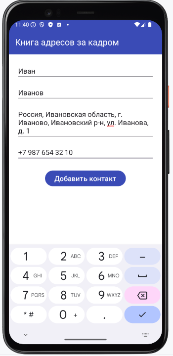
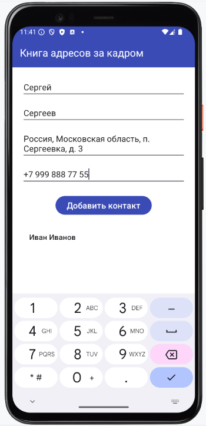
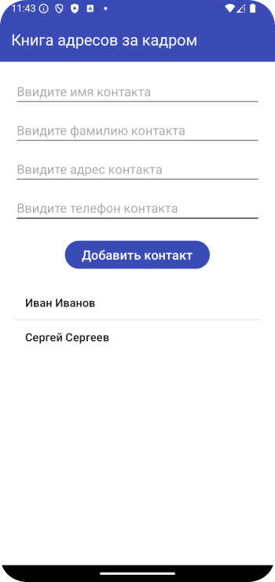

# Домашнее задание по теме "Serializable, Parcelable"

### Приложения «Книга адресов за кадром».

Приложение состоит из двух экранов. На первом мы вводим данные адресата: фамилия, имя, адрес, телефон. После введения этих данные адресата помещаются в список на первом экране, но только имя и фамилия. По нажатию на элемент списка приложение переходит на второй экран, где отображаются развернутые данные человека: фамилия, имя, адрес, телефон.

**На первом экране необходимо создать:**

1. Поля ввода имени, фамилии, адреса и телефона.

2. Кнопку **«Сохранить»**.

3. Список `ListView` для отображения данных имени и фамилии адресата.

**На втором экране необходимо создать:**

1. Поля вывода информации: имени, фамилии, адреса и телефона. Т.к. второй экран является демонстративным, то здесь можно задать заголовки, поменять цвет фона, стили шрифтов, их размеры, придавая тем самым смотрибельность выбранной карточке об адресате.

Для передачи данных и создания в качестве модели создать класс `Person` с соответствующими свойствами в конструкторе.

Вся функциональность передачи данных между экранами реализуется на основании тематики пройденного занятия.

Приложение необходимо сохранить проектом в удаленном репозитории, для проверки качества предоставить ссылку преподавателю, либо сделать скрины эмулятора при каждом шаге работы приложения.

### Скриншоты домашнего задания

Скриншоты здесь

